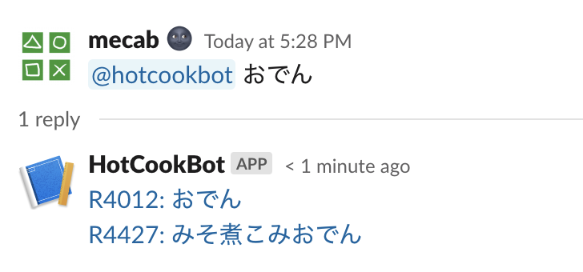
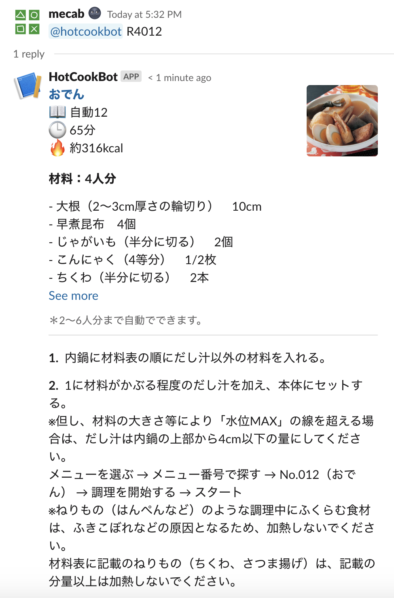
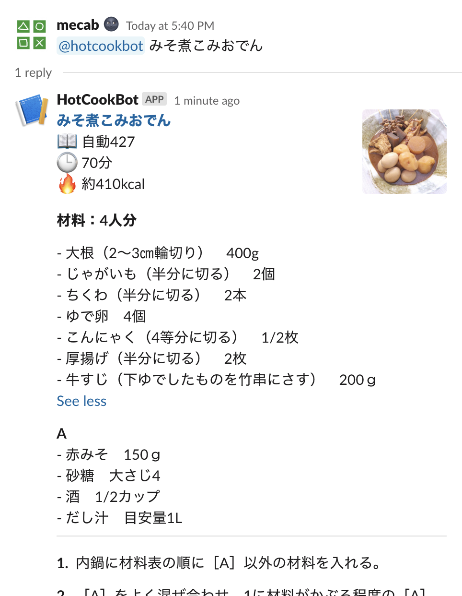

メニュー検索 Slack Bot
=====================

ホットクックのレシピを検索し、またレシピの詳細を教えてくれるSlack用のbotです。

動作環境
-------

- Node.js >= v10.0.0

できること
---------

### レシピを検索する

キーワードをメンションすると、レシピ検索結果を表示します。

```
@hotcookbot おでん
```




### レシピの詳細を表示する

検索結果で得られたレシピIDをメンションすると、詳細を表示します。

```
@hotcookbot R4012
```



検索時、ヒット件数が1つのみの場合は、直接詳細を表示します。

```
@hotcookbot みそ煮こみおでん
```



インストール
----------

### Slackにbotアカウントを登録し、トークンを取得する。

0. 事前準備を行います。  
   Slackの公式ドキュメント[Enabling interactions with bots](https://api.slack.com/bot-users)の[**Getting Started**](https://api.slack.com/bot-users#getting-started) 1.〜3.を参考にして、botアカウントを追加し、bot tokenを取得してください。（2. Setting up the Events API は行わなくて構いません。）

1. 以下のコマンドで、ソースコードのダウンロードとビルドを行います。
   ```bash
   $ git clone https://github.com/mecab/slack-hotcook-bot.git
   $ cd slack-hotcook-bot
   $ npm i
   $ npm run build
   ```

2. 以下のコマンドでbotを起動します。
   ```bash
   $ SLACK_TOKEN=xoxb-XXXXXXXX(0.で取得したbot token) npm start
   ```

   サービスとして起動したままにしたい場合は、systemd [^1] やforever [^2] で良い感じにやってください。

3. 前章の使い方の通り、botにメンションを投げて、レシピを検索したり、詳細を見たりします。

4. ホットクックでおいしいごはんを作ります 🍲

副産物
-----
- ホットクックのレシピを検索するnpmパッケージ [@mecab/hotcook](https://www.npmjs.com/package/@mecab/hotcook) (リポジトリ: [mecab/node-hotcook](https://github.com/mecab/node-hotcook))  
  本bot内部でも利用しています。

ライセンス
---------
MIT

脚注
----
[^1]: [Systemdを使ってさくっと自作コマンドをサービス化してみる - Qiita](https://qiita.com/DQNEO/items/0b5d0bc5d3cf407cb7ff)

[^2]: [Node.jsでforeverを使ってスクリプトの起動を永続化する – 塩焼きブログ](https://sioyaki.com/entry/2016/05/07/014028)